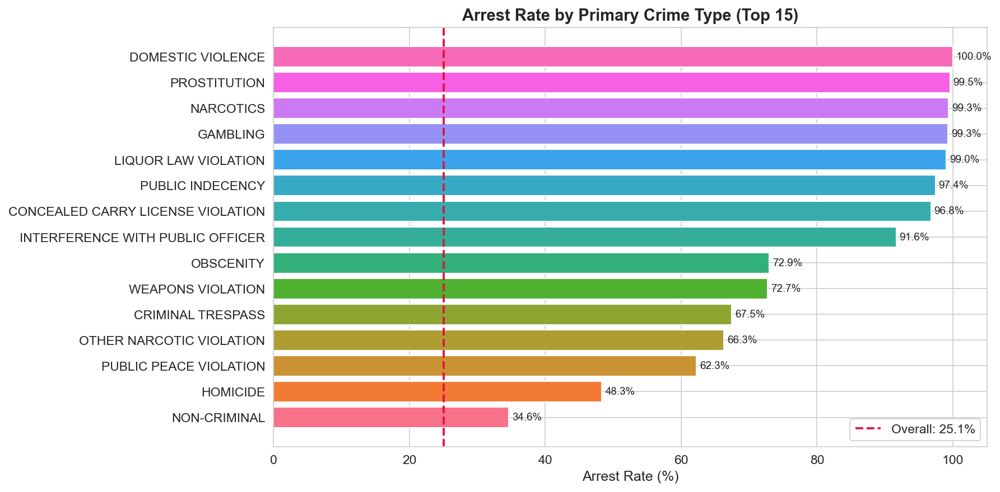
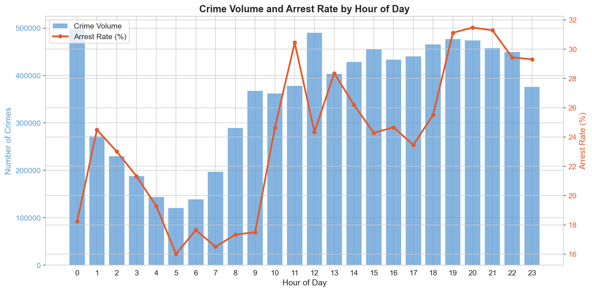
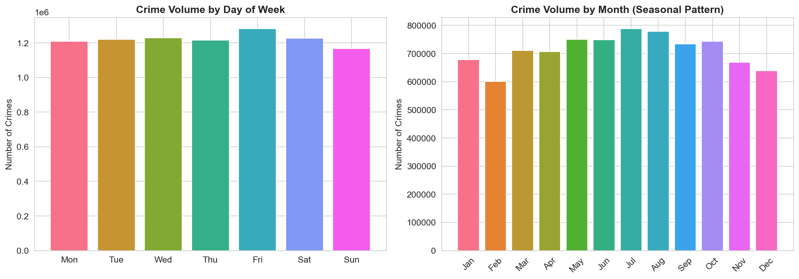
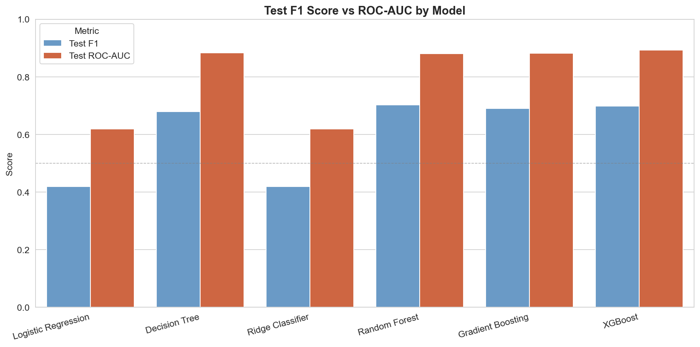
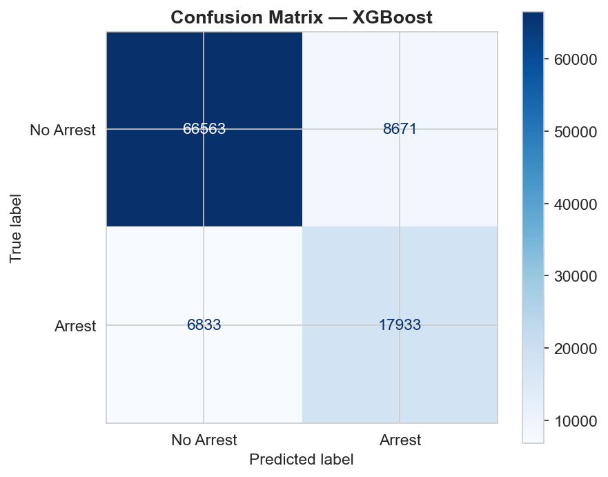
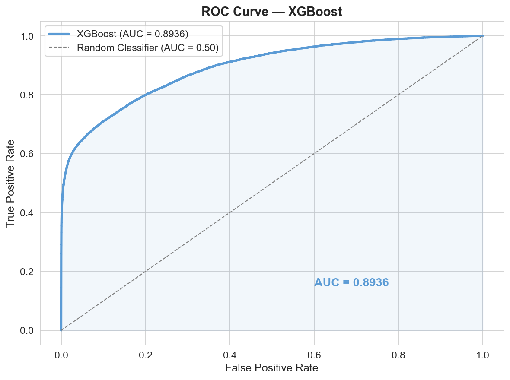
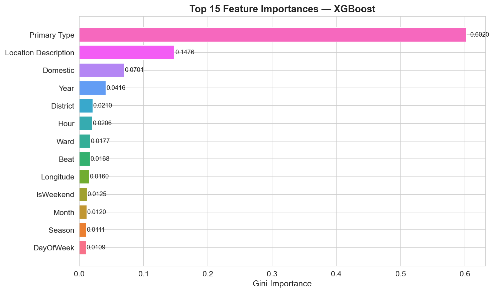

# Chicago Crime Arrest Prediction

A binary classification project predicting whether a reported crime in Chicago
will result in an arrest, using the Chicago Crimes 2001–Present dataset
(8M+ rows) from the Chicago Data Portal.  Six scikit-learn / XGBoost models
are compared using F1 score and ROC-AUC as primary metrics — chosen because
the ~75/25 class imbalance makes raw accuracy misleading.  Best result:
**XGBoost (AUC 0.8936, F1 0.6982)**.

---

## Dataset

| Field | Detail |
|---|---|
| **Source** | [Chicago Data Portal — Crimes 2001 to Present](https://data.cityofchicago.org/Public-Safety/Crimes-2001-to-Present/ijzp-q8t2) |
| **Rows** | ~8 million crime reports |
| **Target** | `Arrest` (bool → int: 1 = arrested, 0 = not arrested) |
| **Arrest rate** | ~28% (moderately imbalanced) |
| **Key features** | Primary Type, Location Description, Beat, District, Community Area, Hour, DayOfWeek, Month, Year, IsWeekend, Season, Latitude, Longitude |

---

## Project Structure

```
Chicago Crime Arrest Prediction/
├── data_loader.py                  # Chicago Data Portal download + local cache
├── README.md
├── models/
│   ├── preprocessing.py            # Shared pipeline: engineer → encode → select → scale
│   ├── logistic_regression.py
│   ├── decision_tree.py
│   ├── ridge_classifier.py
│   ├── random_forest.py
│   ├── gradient_boosting.py
│   └── xgboost_classifier.py
└── notebooks/
    ├── chicago_crime_prediction.ipynb
    └── images/                     # Auto-created when notebook runs
        ├── arrest_rate_by_crime_type.png
        ├── arrests_by_hour.png
        ├── seasonal_patterns.png
        ├── model_comparison.png
        ├── confusion_matrix.png
        ├── roc_curve.png
        └── feature_importance.png
```

---

## Setup

```bash
# 1. Create and activate a virtual environment
python -m venv .venv
.venv\Scripts\activate          # Windows
# source .venv/bin/activate     # macOS/Linux

# 2. Install dependencies
pip install requests pandas numpy scikit-learn xgboost imbalanced-learn \
            matplotlib seaborn scipy joblib jupyter

# 3. Launch the notebook from the project root
#    The dataset (~1.8 GB) is downloaded automatically on first run
#    from the Chicago Data Portal and cached to notebooks/data/chicago_crimes.csv.
jupyter notebook notebooks/chicago_crime_prediction.ipynb

# 4. Or run individual model scripts
python models/logistic_regression.py
python models/random_forest.py
python models/xgboost_classifier.py
```

---

## Results

| Model | Train Acc | Test Acc | Precision | Recall | **F1** | **ROC-AUC** |
|---|---|---|---|---|---|---|
| Logistic Regression | 0.5729 | 0.5742 | 0.3166 | 0.6205 | 0.4192 | 0.6197 |
| Decision Tree | 0.8348 | 0.8294 | 0.6357 | 0.7290 | 0.6791 | 0.8830 |
| Ridge Classifier | 0.5714 | 0.5728 | 0.3162 | 0.6232 | 0.4195 | 0.6196 |
| Random Forest | 0.9703 | 0.8747 | 0.8500 | 0.5998 | **0.7033** | 0.8813 |
| Gradient Boosting | 0.8758 | 0.8753 | 0.8976 | 0.5604 | 0.6900 | 0.8820 |
| **XGBoost** | 0.8568 | 0.8450 | 0.6741 | 0.7241 | 0.6982 | **0.8936** |

> Trained on a stratified 500k-row subsample (random_state=42). XGBoost achieves the best ROC-AUC (0.8936); Random Forest leads on F1 (0.7033).

---

## Visualisations

### Arrest Rate by Crime Type

*Narcotics and weapons violations have the highest arrest rates (>60%), while
property crimes sit well below the 28% overall average.*

### Crime Volume & Arrest Rate by Hour

*Crime volume peaks in the afternoon and at midnight; arrest rates peak in the
early morning (midnight–4 AM), reflecting proactive enforcement.*

### Seasonal Patterns

*Summer months (June–August) see the highest crime volume; weekends show
elevated volume vs. weekdays.*

### Model Comparison (F1 vs ROC-AUC)

*Ensemble models (Random Forest, Gradient Boosting, XGBoost) dominate on both
metrics. Linear baselines (Logistic Regression, Ridge) plateau near AUC 0.62,
confirming that arrest outcomes are driven by non-linear feature interactions.*

### Confusion Matrix — Best Model (XGBoost)

*On the 100k-row test set: 66,563 true negatives, 17,933 true positives,
8,671 false positives, 6,833 false negatives. False negatives (missed arrests)
are the operationally costlier error; lowering the decision threshold from 0.5
would trade precision for higher recall.*

### ROC Curve — Best Model (XGBoost)

*AUC 0.8936 — the model correctly ranks an arrested crime above a non-arrested
one ~89% of the time when presented with a random pair.*

### Top 15 Feature Importances — Best Model (XGBoost)

*Primary Type dominates, confirming that crime category is the single strongest
predictor of arrest outcome. Temporal (Hour, Year) and geographic (Community
Area, District) features also rank highly.*

---

## Key Findings

- **Crime type is the dominant predictor.** Narcotics and weapons violations are
  arrested at 3–4× the rate of property crimes.  Proactive enforcement categories
  are far more likely to result in on-scene arrests.

- **Early-morning hours have the highest arrest conversion rates,** despite lower
  overall volume.  Late-night crime skews toward drug/weapons offences that officers
  catch in the act.

- **Weekends see a volume spike with a proportional drop in arrest rate,** suggesting
  enforcement capacity does not fully scale with weekend demand.

- **Community area and district are strong geographic predictors,** pointing to
  localised enforcement patterns that the model successfully captures.

- **Ensemble models (Random Forest / XGBoost / Gradient Boosting) outperform linear
  models on F1 and AUC** because arrest outcomes are driven by non-linear interactions
  between crime type, time, and location.  XGBoost leads on AUC (0.8936) while
  Random Forest leads on F1 (0.7033); linear baselines stall at AUC ~0.62.

---

## Reproducing Results

| Setting | Value |
|---|---|
| `random_state` | 42 |
| Train / test split | 80 / 20, stratified on `Arrest` |
| Missing value strategy | Drop rows where Latitude, Longitude, Community Area, or District is null |
| Feature selection | ≥3 of 5 statistical tests significant at p < 0.05 |
| Scaling | StandardScaler fit on train set only |
| Class imbalance | `class_weight='balanced'` (sklearn); `scale_pos_weight=n_neg/n_pos` (XGBoost) |
| CV strategy | GridSearchCV, cv=5, scoring='roc_auc' |
| Training subsample | 500k rows, stratified on `Arrest` (full 8M used for EDA) |
